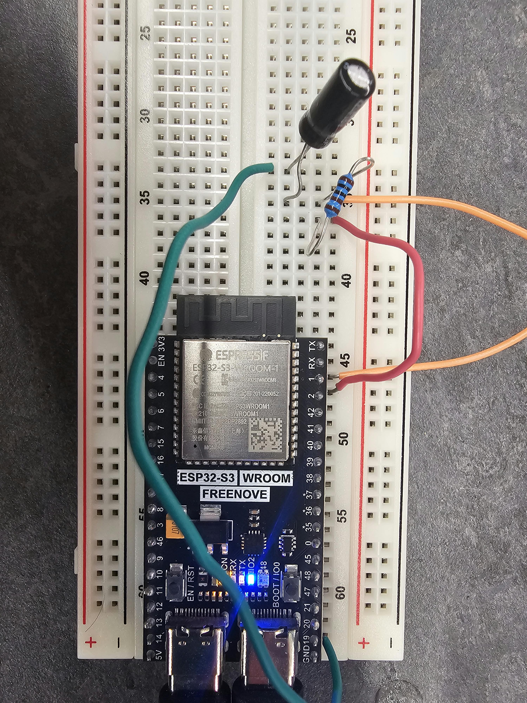
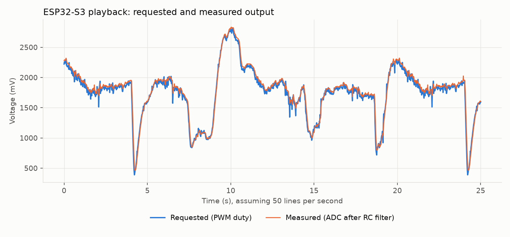

# Fungal waveform playback on an ESP32-S3

This is a small project I built while applying for the Underground Brains
summer research project at UQ. It takes a real electrical recording from a
fungus, the split gill mushroom *Schizophyllum commune*, and plays it back as a
voltage on an ESP32-S3. You can change the amplitude and playback speed over
the serial port, and the board measures its own output so you can check it's
doing what it should.

The recording isn't mine. It comes from Andrew Adamatzky's open dataset [1].



1. A quick warning

The board puts out up to 3.3 V. The fungal signals in the paper are around
0.03 to 2.1 mV [2], so this is more than a thousand times bigger than anything
the fungus produces. It's only meant to show playback and control, so please
dont connect it to anything living.

2. The circuit

The ESP32-S3 doesn't have a DAC [4], so I used PWM instead. GPIO2 switches
between 0 and 3.3 V twenty thousand times a second, and a resistor and
capacitor smooth that into a steady voltage. GPIO1 then reads the smoothed
voltage back on the ADC.

```
GPIO2 (PWM out) ---[ 1 kΩ ]---+--- GPIO1 (ADC in)
                              |
                           [22 µF]   (+ leg on the GPIO1 side)
                              |
                              G
```

That's the whole circuit. GPIO2, GPIO1 and a ground pin are all on the same
header [3].

Some numbers for the filter:

- cut-off of about 7 Hz, from 1 / (2π × 1 kΩ × 22 µF)
- time constant of 22 ms
- roughly 2 mV of PWM ripple left over at half duty

The ADC can read up to about 3.1 V [5], so the output defaults to 80 % of full
scale to stay inside that.

3. Data collection

The *S. commune* file has seven channels and 263,954 samples, recorded at one
sample per second [1]. The processing is in `tools/prepare_waveform.py`.

The first thing I noticed was that every channel swings by several millivolts
in the first 5 to 10 hours and then settles, all at the same time. That looks
like the electrodes settling after setup rather than the fungus, so I skipped
the first 10 hours.

The activity I was after is tiny compared with the slow drift, so I subtracted
a 60-minute moving average from the recording. After that I compared the six
usable channels (channel 6 dips to −71 mV at one point, which I treated as an
electrode problem) and picked channel 2, from hour 41 to hour 45. It has four
clear events where the voltage drops by about 0.1 mV and then recovers more
slowly.

Those 14,400 samples are averaged down to 2,000 points, scaled to 0–1023 for
the 10-bit PWM, and saved as `waveform.h`.


*Top: the whole recording, with my four-hour window shaded. Middle: the window
after drift removal, which is what gets played. Bottom: its spectrum.*

4. Working

First I ran a 1 Hz sine wave through it. The measured wave trailed the
requested one by about 20 ms, which is basically the filter's 22 ms time
constant, and it read about 20 mV high at the bottom of the wave.

Then the real recording, at `t 20`, which plays the four hours in 20 seconds
(720 times faster than real time).



Over 25 seconds, the measured voltage was on average 27 mV above what was
requested, with an RMS difference of 57 mV. That's about 2 % of the 2.5 V
output swing. The offset is close to what the sine test showed, and most of
the rest comes from the filter lagging on the sharp drops, plus the odd ADC
spike.

I also checked the timing. At this speed one second of playback is 12 minutes
of recording. The deepest drop (at 42.75 h) shows up at 4.2 s and again at
24.2 s, one full pass later, and the other events land where they should:

| Event in the recording | Expected | What I saw |
| --- | --- | --- |
| Drop at 43.45 h | 7.7 s | 7.5 s |
| Rise at 43.9 h | 10.0 s | about 10 s |
| Drop at 44.9 h | 15.0 s | 14.7 s |
| Drop at 41.65 h (after the loop restarts) | 18.7 s | 18.7 s |

5. Things to keep in mind

- The spectrum's biggest peak is around 0.4 mHz, roughly once every 40
  minutes. I wouldn't read that as a real spike interval, though. Taking out
  the 60-minute average suppresses anything slower, so a peak just above that
  is partly made by the processing, and four hours is too short to measure an
  interval anyway.
- At one sample per second the file covers about 73 hours, but the dataset
  description says this species was recorded for 1.5 days [1]. I've kept the
  stated rate. If it were really two samples per second, every time here would
  halve.
- The events I picked are about 0.1 mV, bigger than the 0.03 mV average the
  paper reports for this species [2]. I chose the window because the events
  are clear, not because it's typical.
- Every so often the readback has a one-sample jump of a few hundred millivolts
  that isn't in the requested signal. As far as I can tell that's ADC noise.
- The segment loops, so there's a step of about 0.3 V where the end meets the
  start.

6. Running it yourself

```
python3 -m venv .venv
source .venv/bin/activate
pip install numpy matplotlib pyserial

python3 tools/prepare_waveform.py "Schizophyllum commune.txt" --list
python3 tools/prepare_waveform.py "Schizophyllum commune.txt" --channel 2 \
    --start-h 41 --hours 4 --detrend-min 60 --label "Schizophyllum commune"
```

Upload `fungal_playback.ino` from the Arduino IDE (board: ESP32S3 Dev Module)
and send `t 20` in the Serial Monitor. To record the output, close the Serial
Monitor and run:

```
python3 tools/plot_readback.py --port <your port> --seconds 25
```

Serial commands:

| Command | What it does |
| --- | --- |
| `a <0-100>` | amplitude, as a percent of full scale |
| `t <seconds>` | time for one pass through the waveform |
| `s` / `w` | sine test / recorded waveform |
| `q` | turn the data stream on or off |
| `?` | show what's playing and at what speed |

7. How this was made

I used an AI assistant (Claude) to help write the code and this README. I built
and tested the circuit, ran the processing, chose the channel and window, and
checked the playback against the original recording.

8. References

1. Adamatzky A (2021). *Recordings of electrical activity of four species of fungi* (dataset). Zenodo. https://zenodo.org/records/5790768
2. Adamatzky A (2022). Language of fungi derived from their electrical spiking activity. *Royal Society Open Science* 9(4), 211926. https://pmc.ncbi.nlm.nih.gov/articles/PMC8984380
3. Espressif Systems. *ESP32-S3-DevKitC-1 v1.1 User Guide*. https://docs.espressif.com/projects/esp-dev-kits/en/latest/esp32s3/esp32-s3-devkitc-1/user_guide_v1.1.html
4. TechOverflow (2026). *What resolution does the ESP32 DAC have?* https://techoverflow.net/2026/07/30/what-resolution-does-the-esp32-dac-have/
5. Espressif Systems. *Analog to Digital Converter (ADC)*, ESP-IDF Programming Guide for ESP32-S3. https://docs.espressif.com/projects/esp-idf/en/v4.4.8/esp32s3/api-reference/peripherals/adc.html
